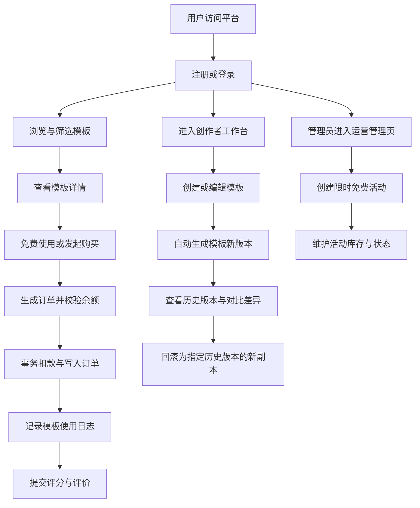

## 1. 产品概述
本项目是一个围绕 AI 提示词模板开发与交易的 Web 平台，支持模板创建、版本留痕、标签筛选、购买使用、评分评价、限时免费和数据分析等完整业务闭环。
- 目标用户包括普通使用者、模板创作者和平台管理员，重点解决提示词模板难管理、难追溯、难交易、难分析的问题。
- 项目兼顾课程设计可展示性与工程规范性，采用标准 Spring Boot 单体架构，提供前后台一体化网页界面与可扩展的数据模型。

## 2. 核心功能

### 2.1 用户角色
| 角色 | 注册方式 | 核心权限 |
|------|----------|----------|
| 游客 | 无需注册 | 浏览模板列表、查看模板详情、搜索与筛选 |
| 注册用户 | 邮箱或手机号注册 | 登录、收藏模板、购买模板、使用模板、评价模板、查看个人中心 |
| 创作者 | 注册用户自动具备发布能力 | 创建模板、编辑模板、查看版本、回滚版本、查看收入与使用统计 |
| 平台管理员 | 系统初始化分配 | 管理活动、查看平台总览、处理上下架、查看全站统计 |

### 2.2 功能模块
1. **首页与发现页**：平台概览、热门模板榜、搜索框、多条件筛选、标签导航、推荐模板。
2. **用户认证页**：邮箱/手机号注册、密码登录、基础校验与登录态管理。
3. **模板详情页**：模板基础信息、当前 Prompt、标签、评分、收藏、购买与使用入口、评论列表。
4. **创作者工作台**：模板创建、编辑、版本管理、版本对比、回滚、上下架、收入统计、趋势图。
5. **个人中心**：已发布模板、收藏列表、使用记录、账户余额、余额流水、订单记录。
6. **运营管理页**：限时免费活动配置、剩余份数管理、平台总览数据展示。

### 2.3 页面详情
| 页面名称 | 模块名称 | 功能描述 |
|-----------|-----------|-----------|
| 首页 | 顶部导航 | 展示平台名称、登录入口、创作者中心、个人中心入口 |
| 首页 | 搜索与筛选区 | 按关键字、标签、评分范围、价格区间、排序方式筛选模板 |
| 首页 | 热门榜单区 | 按热度、评分、收藏综合排序展示热门模板 |
| 首页 | 推荐区 | 基于用户使用标签偏好展示相似模板 |
| 登录注册页 | 注册表单 | 支持邮箱或手机号注册，录入用户名、密码、联系方式 |
| 登录注册页 | 登录表单 | 支持邮箱或手机号 + 密码登录 |
| 模板详情页 | 模板信息卡片 | 展示标题、场景描述、价格、标签、创作者、当前版本信息 |
| 模板详情页 | Prompt 内容区 | 查看当前版本 Prompt 内容和版本号 |
| 模板详情页 | 操作区 | 收藏、购买、领取限免、使用模板、提交评分评价 |
| 模板详情页 | 评论区 | 查看历史评分和文字评价 |
| 创作者工作台 | 模板编辑器 | 新建模板，编辑标题、场景、价格、标签和 Prompt 内容 |
| 创作者工作台 | 版本历史 | 查看历史版本列表、变更说明、创建时间 |
| 创作者工作台 | 版本对比 | 对比两个版本 Prompt 内容差异 |
| 创作者工作台 | 模板管理 | 模板上架、下架、查看使用统计和收藏数 |
| 创作者工作台 | 数据看板 | 展示近 30 天使用趋势、月收入统计、模板收入排行 |
| 个人中心 | 我的模板 | 展示用户已发布模板及其状态 |
| 个人中心 | 我的收藏 | 展示已收藏模板列表并支持取消收藏 |
| 个人中心 | 使用记录 | 展示模板使用日志、时间和输入摘要 |
| 个人中心 | 账户中心 | 展示账户余额、收入明细、消费明细 |
| 运营管理页 | 活动配置 | 创建限时免费活动，设置时间段、限量份数、适用模板 |
| 运营管理页 | 平台总览 | 展示总用户数、总模板数、总交易额、日活用户数 |

## 3. 核心流程
普通用户进入首页后可搜索模板、查看详情、购买或领取活动名额，使用模板后系统记录使用日志，并允许用户提交评分与评价。创作者可在工作台创建模板，每次编辑都会自动生成新版本，支持查看版本列表、内容对比和回滚。管理员可配置限时免费活动、查看平台指标并监督核心运营数据。

## 4. 用户界面设计

### 4.1 设计风格
- 主色调采用深海蓝与青绿色，强调平台感、数据感和专业感。
- 页面风格采用规整后台式布局，卡片边框清晰，图表与表格对齐，减少花哨装饰。
- 字体优先使用中文友好的无衬线字体，标题偏中粗，正文规整紧凑。
- 布局采用桌面优先，顶部导航 + 左侧功能导航 + 主内容区。
- 图表采用横平竖直的折线图和柱状图，避免曲线过度修饰。

### 4.2 页面设计概览
| 页面名称 | 模块名称 | UI 元素 |
|-----------|-----------|-----------|
| 首页 | 搜索区 | 通栏搜索框、标签筛选抽屉、价格区间选择、排序按钮 |
| 首页 | 模板列表 | 规整卡片网格、价格角标、标签胶囊、评分星级、收藏按钮 |
| 模板详情页 | 内容主体 | 左侧模板信息，右侧操作面板，下方评论区与版本信息 |
| 创作者工作台 | 编辑区 | 表单 + Prompt 编辑器 + 版本侧栏 + 保存草稿/发布按钮 |
| 创作者工作台 | 数据看板 | 折线图、柱状图、统计卡片、按模板收入排行表 |
| 个人中心 | 信息概览 | 用户卡片、余额卡片、最近订单、最近使用记录 |
| 运营管理页 | 平台总览 | 指标卡片、日活折线图、活动列表、库存状态标签 |

### 4.3 响应式策略
- 采用桌面优先设计，主目标分辨率为 1440px 及以上。
- 在平板宽度下折叠部分筛选区和侧边栏。
- 在移动端保留核心浏览、搜索、购买和使用功能，后台管理能力简化展示。

## 5. 业务规则
- 同一模板每次编辑必须新增一条版本记录，不允许直接覆盖历史版本。
- 版本回滚通过“基于历史版本生成新版本”的方式完成，保证审计链完整。
- 付费模板购买时必须校验账户余额，订单创建、余额扣减、余额流水写入必须处于同一事务。
- 用户仅能对已实际使用过的模板进行评分评价，评分范围为 1 到 5 分。
- 限时免费活动仅对指定模板生效，活动需校验时间窗口、总份数、剩余份数和单用户领取次数。
- 创作者等级根据模板累计使用量、平均评分和有效交易额综合计算，并按规则自动更新。

## 6. 非功能要求
- 数据库设计至少满足第三范式，主外键与唯一约束清晰。
- 页面需提供良好的表单校验、异常提示和空状态展示。
- 关键业务支持日志记录与审计追踪，便于课程设计答辩说明。
- 系统采用前后端分层结构，便于后续扩展推荐算法、支付接口和权限系统。
