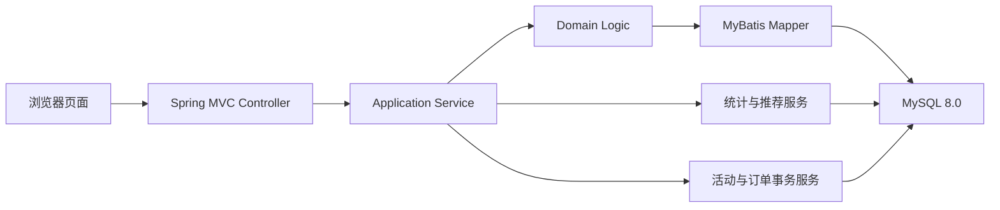
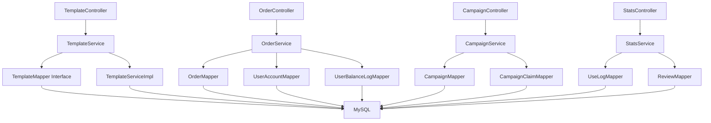
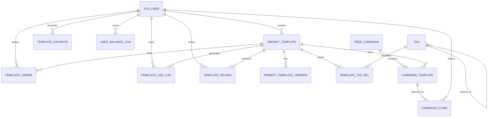

## 1. 架构设计
本项目采用标准 Spring Boot 单体分层架构，前端页面与后端业务统一部署，适合课程设计展示、数据库事务控制和后续扩展。

## 2. 技术说明
- 后端框架：Spring Boot 3.x
- Web 层：Spring MVC + Thymeleaf
- 持久层：MyBatis-Plus
- 数据库：MySQL 8.0
- 构建工具：Maven
- 工具库：Lombok、Spring Validation、SLF4J + Logback
- 图表方案：ECharts
- 安全方案：Spring Interceptor + Session 登录态管理
- 测试方案：Spring Boot Test + MockMvc + Mapper SQL 验证

## 3. 分层与包结构
- `controller`：处理页面请求、表单提交、REST 接口输出。
- `service`：定义业务接口与实现类，控制器仅依赖抽象，符合开闭原则。
- `mapper`：定义 MyBatis-Plus 数据访问接口，直接复用通用 CRUD 和分页能力。
- `entity`：数据库实体对象。
- `dto`：页面交互和服务入参出参对象。
- `config`：MVC、拦截器、MyBatis-Plus 分页插件、时间格式等配置。
- `util`：公共工具类。
- `templates`：Thymeleaf 页面模板。
- `static`：CSS、JavaScript、图片和图表脚本资源。
- `sql`：建表脚本、初始化数据、索引和视图脚本。

## 4. 页面路由定义
| 路由 | 用途 |
|------|------|
| `/` | 首页，展示搜索、热门模板、推荐模板 |
| `/login` | 登录页 |
| `/register` | 注册页 |
| `/templates/{id}` | 模板详情页 |
| `/templates/{id}/use` | 模板使用页 |
| `/creator/dashboard` | 创作者工作台首页 |
| `/creator/templates/new` | 创建模板页 |
| `/creator/templates/{id}/edit` | 编辑模板页 |
| `/creator/templates/{id}/versions` | 版本历史与对比页 |
| `/profile` | 个人中心首页 |
| `/profile/favorites` | 我的收藏 |
| `/profile/orders` | 我的订单 |
| `/profile/usages` | 我的使用记录 |
| `/admin/dashboard` | 平台总览页 |
| `/admin/campaigns` | 活动管理页 |

## 5. 接口定义

### 5.1 认证接口
| 接口 | 方法 | 说明 |
|------|------|------|
| `/api/auth/register` | POST | 用户注册，支持邮箱或手机号 |
| `/api/auth/login` | POST | 用户登录 |
| `/api/auth/logout` | POST | 用户退出 |

### 5.2 模板接口
| 接口 | 方法 | 说明 |
|------|------|------|
| `/api/templates/search` | GET | 模板搜索与多条件筛选 |
| `/api/templates` | POST | 创建模板 |
| `/api/templates/{id}` | PUT | 编辑模板并自动生成新版本 |
| `/api/templates/{id}/shelf` | PUT | 模板上架或下架 |
| `/api/templates/{id}/favorite` | POST | 收藏模板 |
| `/api/templates/{id}/favorite` | DELETE | 取消收藏 |
| `/api/templates/{id}/rollback/{versionId}` | POST | 回滚到指定版本并生成新版本 |

### 5.3 版本接口
| 接口 | 方法 | 说明 |
|------|------|------|
| `/api/template-versions/{templateId}` | GET | 查看模板版本列表 |
| `/api/template-versions/compare` | GET | 对比两个版本内容差异 |

### 5.4 交易与使用接口
| 接口 | 方法 | 说明 |
|------|------|------|
| `/api/orders` | POST | 购买模板并创建订单 |
| `/api/templates/{id}/use` | POST | 使用模板并写入使用日志 |
| `/api/reviews` | POST | 提交评分与评价 |

### 5.5 活动与统计接口
| 接口 | 方法 | 说明 |
|------|------|------|
| `/api/campaigns` | POST | 新建限时免费活动 |
| `/api/campaigns/{id}/claim` | POST | 领取活动模板名额 |
| `/api/stats/creator` | GET | 创作者收入与趋势统计 |
| `/api/stats/platform` | GET | 平台总览指标 |
| `/api/recommend/templates` | GET | 获取推荐模板列表 |

## 6. 服务架构图

## 7. 数据模型

### 7.1 E-R 关系说明
- 用户与模板是一对多关系，一个用户可发布多个模板。
- 模板与模板版本是一对多关系，一个模板可包含多个历史版本。
- 模板与标签是多对多关系，通过关联表维护。
- 标签与标签是自关联一对多关系，用于表示多级层级标签。
- 用户与订单是一对多关系，用户购买模板形成订单记录。
- 用户与模板使用日志是一对多关系，模板与使用日志也是一对多关系。
- 用户与模板评价是一对多关系，模板与模板评价也是一对多关系。
- 活动与模板是多对多关系，通过活动模板关联表维护库存。

### 7.2 核心表设计
| 表名 | 作用 | 关键字段 |
|------|------|----------|
| `sys_user` | 用户主表 | 用户名、密码、邮箱、手机号、余额、创作者等级、状态 |
| `user_balance_log` | 余额流水 | 变动类型、变动金额、变动前后余额、业务关联 |
| `prompt_template` | 模板主表 | 标题、场景描述、当前版本、价格、上下架状态、统计字段 |
| `prompt_template_version` | 模板版本表 | 版本号、Prompt 内容、变更说明、编辑人、来源版本 |
| `tag` | 标签表 | 标签名、父标签、层级、路径 |
| `template_tag_rel` | 模板标签关系表 | 模板 ID、标签 ID |
| `template_favorite` | 收藏关系表 | 用户 ID、模板 ID |
| `template_review` | 评分评价表 | 评分、评价内容、评价状态、关联使用记录 |
| `template_order` | 订单表 | 订单号、金额、支付状态、订单状态、支付时间 |
| `template_use_log` | 使用日志表 | 用户 ID、模板 ID、版本 ID、输入摘要、使用时间 |
| `free_campaign` | 限时免费活动表 | 活动名、开始结束时间、状态 |
| `campaign_template` | 活动模板配置表 | 总份数、剩余份数、单用户限制 |
| `campaign_claim` | 活动领取记录表 | 用户 ID、领取状态、领取时间、关联订单 |

## 8. 数据定义语言设计

### 8.1 关键约束
- `sys_user.username`、`email`、`phone` 设置唯一约束。
- `prompt_template_version` 设置联合唯一键 `(template_id, version_no)`。
- `template_tag_rel` 设置联合唯一键 `(template_id, tag_id)`。
- `template_favorite` 设置联合唯一键 `(user_id, template_id)`。
- `campaign_template` 设置联合唯一键 `(campaign_id, template_id)`。
- `campaign_claim` 设置联合唯一键 `(campaign_template_id, user_id)`。
- 评分字段限制为 1 到 5，金额和余额字段限制为非负。

### 8.2 索引策略
- 模板检索索引：标题、场景描述、上架状态、价格、创建时间。
- 版本检索索引：模板 ID、版本号、创建时间。
- 评论检索索引：模板 ID、评分、创建时间。
- 订单检索索引：用户 ID、支付状态、创建时间。
- 使用日志索引：模板 ID、用户 ID、使用时间。
- 活动索引：活动时间段、模板 ID、剩余份数。

### 8.3 事务设计
- `购买模板`：校验模板状态 -> 校验是否已拥有 -> 校验余额 -> 生成订单 -> 扣减余额 -> 记录余额流水 -> 更新创作者待结算收入。
- `领取限免`：校验活动时间 -> 校验剩余份数 -> 校验用户是否重复领取 -> 扣减剩余份数 -> 写入领取记录 -> 生成零元订单或权益记录。
- `模板编辑`：更新模板主表 -> 生成新版本记录 -> 更新当前版本指针。
- `版本回滚`：读取目标历史版本 -> 复制 Prompt 内容 -> 生成新版本记录 -> 更新当前版本指针。

## 9. 设计取舍
- 采用 Spring Boot + Thymeleaf，而不是前后端完全分离，目的是降低课程设计集成成本，突出数据库与业务事务实现。
- 控制器只依赖服务接口，具体实现类可替换为演示实现、数据库实现或后续远程服务实现，满足开闭原则。
- 模板检索直接采用 MyBatis-Plus 的分页插件与 `Page` 对象，减少手写分页 SQL，提高可维护性。
- 保留 `use_count`、`favorite_count`、`avg_score` 等统计冗余字段，用于首页排行榜和详情页高频查询；其真实来源仍为明细表，满足“规范化基础上的有限反范式”。
- 推荐功能先采用基于标签偏好与历史使用频次的轻量规则推荐，后续可扩展协同过滤或向量检索。
- 登录态先使用 Session 方案，便于课堂演示与传统 MVC 项目集成；若后续前后端分离，可平滑迁移为 JWT。
